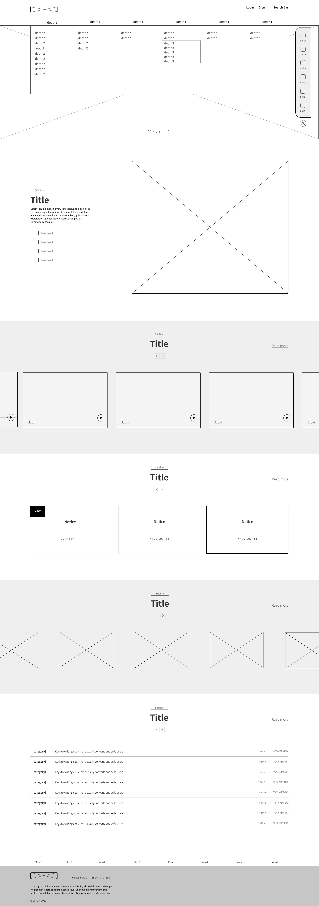

  <a href="https://js4072751.cafe24.com/church/index.html">
    <picture>
      <source media="(prefers-color-scheme: dark)" srcset="./docs/title_W.png">
      
    </picture>
    
  </a>
  

 

  

[반응형웹/리디자인]

 

## 💡 프로젝트 개요
해당 프로젝트는 분당우리교회 웹사이트를 반응형으로 리뉴얼하였습니다.
개인프로젝트로서 디자인, 퍼블리싱을 모두 100% 개인작업으로 진행하였습니다.

 

## 🛠 사용툴
- VS Code
- Figma
- Illustrator
- Photoshop

 

## ✅ UI/UX 디자인

- 레이아웃 선정 - [F자 패턴 🔗](https://www.nngroup.com/articles/f-shaped-pattern-reading-web-content-discovered/)
- 터치스크린 아이콘 적정크기 - [7-10mm 🔗](https://uxplanet.org/checklist-for-using-icons-in-ui-acb6dee36e8a)
- 검색 버튼 - [중요성 및 적정위치 🔗](https://designmodo.com/ux-search-website/)
- 모바일 헤더 - [고정요소 관련 UX 심리학 🔗](https://cafemedia.com/best-practices-for-sticky-elements-in-ux-design/)
- 슬라이더 디자인 - [슬라이더 사용 조건, 탭버튼필요성 🔗](https://www.nngroup.com/articles/gui-slider-controls/)

 

## 📐 와이어프레임

  
 펼치기 / 접기 

  
  
    

      
    

    
[와이어프레임]

  

 

## 🏆 목표

- 전연령층 및 장애인의 사용성 고려
- 어떤 기기든 최적의 웹 페이지를 볼 수 있도록 함
- 방문자를 위한 디자인

 

## ✨ 개선점

- 드롭메뉴 스타일로 하위항목 정리, 6개로 메뉴구성 축소
- 아이콘을 추가하여 글자수를 줄임
- 대체 텍스트 사용하여 시각적 정보 취약 사용자를 위한 기능 개선
- 중요한 항목을 퀵메뉴로 변경하여 어디서든 접근성을 높임
- 가운데 정렬로 균형을 맞춤 
